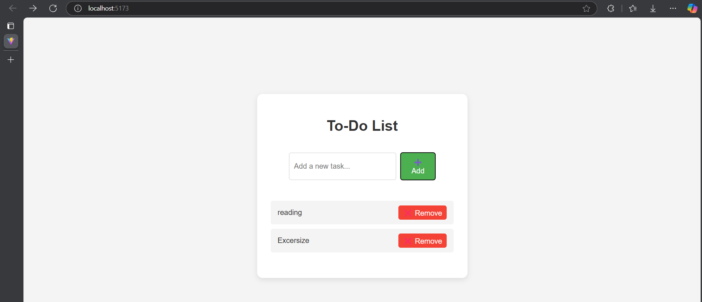

# To-Do List

Objective: Learn how to dynamically render and manage a list of items with conditional rendering.

### Tasks:
Create a state variable to store a list of tasks. 
Render the task list dynamically using .map(). 
Add functionality to add and remove tasks. 
Display a message when the task list is empty. 

