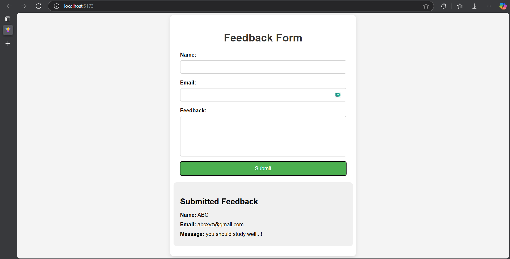

# Feedback Form

Objective: Understand how to handle and validate user input in a React form.

### Tasks:
Create a form with input fields for name, email, and feedback message. 
Use state variables to control the form inputs. 
Validate the inputs (e.g., ensure fields are not empty). 
Display submitted feedback data below the form. 

